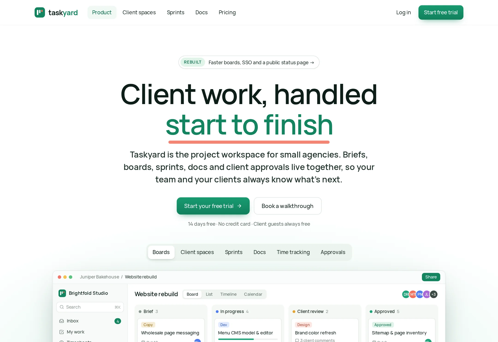

# Taskyard

The project workspace for small agencies — client spaces, boards, sprints, docs and approvals in one fast, secure place.

**Live demo:** https://www.freelancerportfoliohub.com/jameslee/projects/taskyard/index.html



## Overview

Taskyard gives each client its own space with boards, sprints, docs and approvals, and lets studios
invite clients as free guests who only ever see their own work.

This repository holds the marketing site and the parts of the application API it demonstrates. It is
also where the reliability work of the last year landed: a written production-readiness audit, then
hardened sessions and permissions, paginated board loading, a test suite that guards access control,
CI on every pull request, staged releases and error monitoring.

## Features

- **Marketing site** — Product, Client spaces, Sprints and Docs pages with product mockups built in
  HTML/CSS (board, spaces table, sprint panel, doc editor)
- **No-JS by default** — the mobile menu and FAQ accordions are native `<details>` elements
- **Access control** — one `can()` authority for workspace, space and guest rules; guests can't see
  other clients, private spaces or internal hours
- **Signed sessions** — HMAC-signed cookies, shorter guest sessions, studio-wide 2FA policy
- **Paginated boards** — keyset pagination by `(position, id)` so large columns load page by page
- **Sprint rollover** — scheduled job closes due sprints and carries unfinished cards forward
- **Audit log** — approvals and sprint closures recorded append-only
- **Observability** — Sentry for server, edge and browser with masked session replays on error

## Tech stack

| Layer      | Choice                                                |
| ---------- | ----------------------------------------------------- |
| Framework  | Next.js 15 (App Router), React 19                     |
| Language   | TypeScript (strict)                                   |
| Styling    | Plain CSS design system (`styles/`), self-hosted type |
| Validation | zod                                                   |
| Database   | PostgreSQL via Prisma                                 |
| Testing    | Vitest (unit + route integration), Playwright (e2e)   |
| Monitoring | Sentry                                                |
| CI/CD      | GitHub Actions → staging smoke test → production      |

## Getting started

```bash
pnpm install
cp .env.example .env.local   # set SESSION_SECRET and DATABASE_URL at minimum
pnpm db:migrate
pnpm db:seed
pnpm dev
```

Open http://localhost:3000.

### Environment variables

| Variable                                            | Description                                               |
| --------------------------------------------------- | --------------------------------------------------------- |
| `DATABASE_URL`                                      | Postgres connection string                                |
| `SESSION_SECRET`                                    | Signs session cookies (32+ characters)                    |
| `CRON_SECRET`                                       | Bearer token for `/api/cron/sprint-rollover`              |
| `SENTRY_DSN` / `NEXT_PUBLIC_SENTRY_DSN`             | Server and browser DSNs; Sentry is off outside production |
| `SENTRY_AUTH_TOKEN`, `SENTRY_ORG`, `SENTRY_PROJECT` | Source-map upload in CI                                   |
| `NEXT_PUBLIC_RELEASE`                               | Release id (git SHA) reported by `/api/health` and Sentry |

## Testing

```bash
pnpm test            # unit and route-integration tests
pnpm test:coverage   # with coverage; lib/auth is held to 95% lines
pnpm build && pnpm test:e2e
```

The permission suite in `tests/unit/permissions.test.ts` checks every action against every role,
including cross-workspace access. `tests/integration/cards-api.test.ts` calls the route handlers with
real signed cookies, and `e2e/permissions.spec.ts` repeats the guest-isolation checks against a
running server.

## CI/CD

`.github/workflows/ci.yml` runs on every pull request and on `main`:

1. **checks** — lint, typecheck, unit tests with coverage
2. **e2e** — Postgres service, migrations, seed, production build, Playwright on Chromium and WebKit
3. **release** (main only) — build with Sentry source maps, deploy to staging, smoke-test, promote

## Project structure

```
.
├── .github/workflows/   # CI pipeline
├── app/                 # Pages, layout, error boundaries, API route handlers
│   └── api/             # spaces, board cards, approvals, sprint rollover cron, health
├── components/
│   ├── home/            # homepage sections
│   ├── layout/          # header, footer, closing CTA
│   ├── marketing/       # page hero, feature grid, use cases, callout, FAQ
│   ├── mockups/         # product UI: app frame, board, spaces table, sprint panel, doc editor
│   └── ui/              # icons, buttons, avatars, check lists
├── e2e/                 # Playwright specs
├── lib/
│   ├── auth/            # sessions, roles, permissions
│   ├── board/           # keyset pagination and card service
│   ├── data/            # page content and the sandbox workspace
│   └── sprints/         # rollover
├── prisma/              # schema and seed
├── public/fonts/        # Vela Sans
├── styles/              # CSS split by concern
└── tests/               # Vitest unit and integration tests
```

## Scripts

| Script               | Description                          |
| -------------------- | ------------------------------------ |
| `pnpm dev`           | Start the dev server with Turbopack  |
| `pnpm build`         | Generate the Prisma client and build |
| `pnpm start`         | Serve the production build           |
| `pnpm lint`          | ESLint, zero warnings allowed        |
| `pnpm typecheck`     | `tsc --noEmit`                       |
| `pnpm test`          | Vitest                               |
| `pnpm test:coverage` | Vitest with coverage thresholds      |
| `pnpm test:e2e`      | Playwright                           |
| `pnpm db:migrate`    | Apply Prisma migrations              |
| `pnpm db:seed`       | Seed the Brightfold Studio sandbox   |
